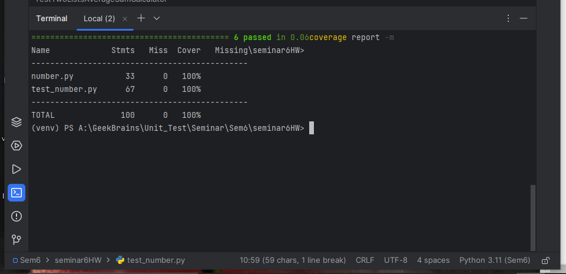
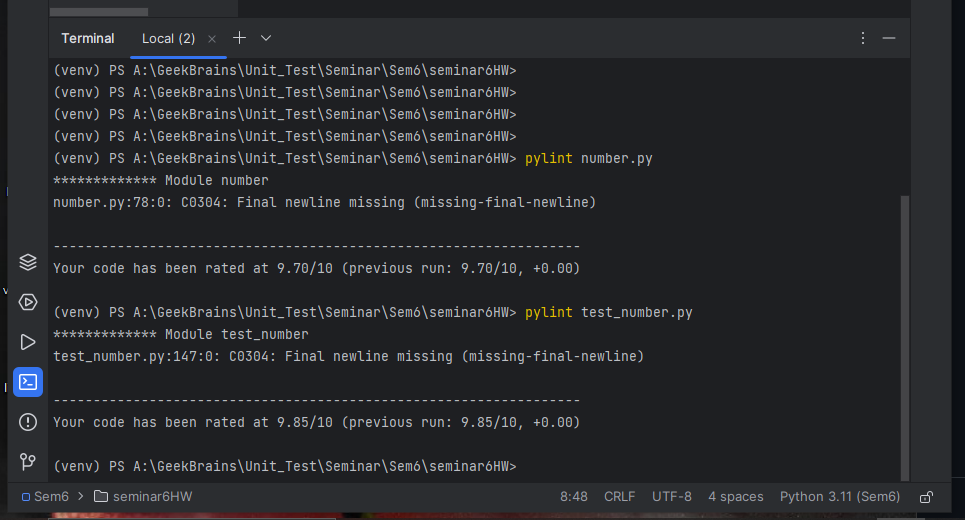

# Домашнее задание по семинару № 6 "Юнит тестирование в других языках"

Тест на покрытие кода `main.py` тестами из `test_number.py` показал 100%.

Протестировал инструментом `Pylint` код класса и код теста: `number.py`, `test_number.py`, были выявлены ошибки на наличие строк большой длины и малое количество аннотаций, исправил.

